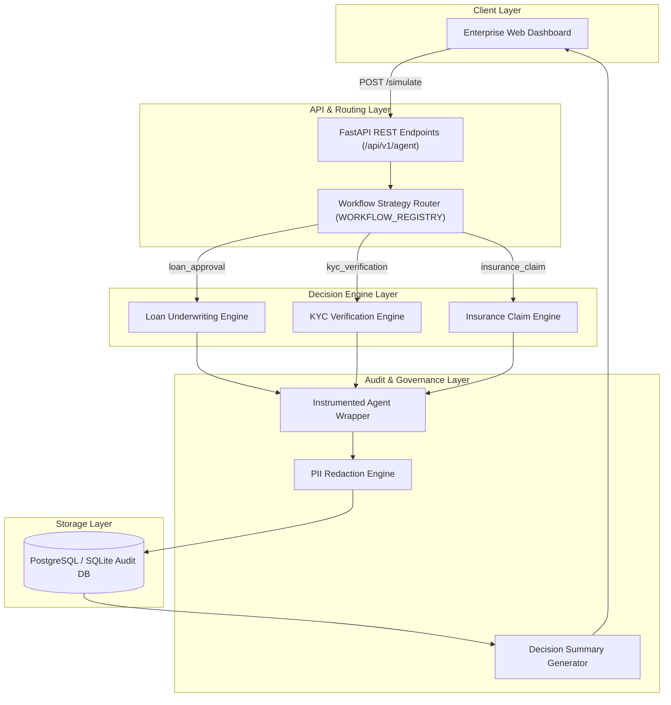
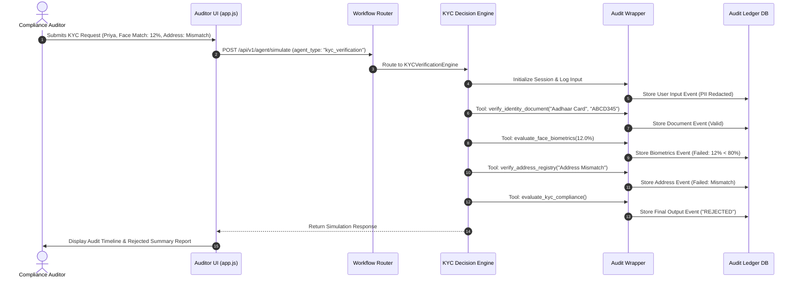

# Enterprise AI Decision Path Auditor


The **Enterprise AI Decision Path Auditor** is a lightweight, non-intrusive AI Governance platform designed to audit, reconstruct, and explain consequential decisions made by autonomous AI agents. Built as an enterprise solution for **PS-7.1 – The Decision Path Auditor**, the platform captures prompt inputs, context retrieval events, intermediate reasoning steps, tool calls, parameter inputs, tool responses, and final outcomes. It enforces automated PII redaction and provides immutable decision timelines and plain-English audit reports for compliance teams, auditors, regulators, and business stakeholders.

---

## Table of Contents
- [Problem Statement](#problem-statement)
- [Solution Overview](#solution-overview)
- [Key Features](#key-features)
- [Supported AI Workflows](#supported-ai-workflows)
- [System Architecture](#system-architecture)
- [Technology Stack](#technology-stack)
- [Project Structure](#project-structure)
- [Installation](#installation)
- [Environment Variables](#environment-variables)
- [Usage Guide](#usage-guide)
- [Example Workflow](#example-workflow)
- [API Endpoints](#api-endpoints)
- [Production Readiness](#production-readiness)
- [Security](#security)
- [Future Improvements](#future-improvements)
- [Screenshots](#screenshots)
- [License](#license)
- [Author](#author)

---

## Problem Statement

As enterprises deploy autonomous AI agents across regulated domains such as banking, insurance, healthcare, and identity verification, traditional logging mechanisms prove insufficient:

1. **Black-Box AI Decisions**: Standard application logs record final API responses but obscure intermediate agent reasoning, tool call sequences, and policy evaluation rules.
2. **Regulatory Non-Compliance**: Regulations (e.g., GDPR, EU AI Act, RBI Guidelines) require transparent auditability and explanation of why an automated agent approved or rejected a specific request.
3. **Data Privacy Leakage**: Storing raw agent interactions risks exposing Personally Identifiable Information (PII) such as PAN numbers, Aadhaar numbers, bank account numbers, phone numbers, and email addresses in plaintext log files.
4. **Domain Coupling**: Existing audit tools are hardcoded to specific use cases, preventing enterprise scalability across multiple business functions.

---

## Solution Overview

The **Enterprise AI Decision Path Auditor** solves these challenges by intercepting and instrumenting AI agent execution paths without modifying core business models:

- **Instrumented Interceptor**: Uses a Python wrapper decorator (`@audit_tool` and `InstrumentedAgentWrapper`) to record execution telemetry at runtime.
- **Decision Path Reconstructor**: Rebuilds the step-by-step chronology of events (User Input $\rightarrow$ RAG Context $\rightarrow$ Reasoning $\rightarrow$ Tool Calls $\rightarrow$ Policy Evaluation $\rightarrow$ Final Outcome).
- **Automated PII Protection**: Uses regular expressions and Presidio-based anonymization to redact PII prior to database log storage.
- **Audit Report Generator**: Translates technical tool call parameters into plain-English compliance summaries, structured policy evaluation matrices, and recommended operational next steps.

---

## Key Features

- **Instrumented Agent Wrapper**: Intercepts prompts, context retrieval, intermediate reasoning, tool calls, tool responses, error traces, and timing.
- **Decision Path Reconstruction**: Rebuilds execution trajectories into 9-step audit timelines.
- **Automated PII Redaction**: Redacts Indian PAN cards, Aadhaar numbers, bank account numbers, emails, and phone numbers.
- **Modular Workflow Strategy Engine**: Supports dynamic execution across multiple domain engines via a unified registry (`WORKFLOW_REGISTRY`).
- **Policy Evaluation Matrix**: Renders side-by-side compliance matrices comparing requested values against policy thresholds.
- **Plain-English Decision Summaries**: Generates non-technical audit explanations suitable for loan officers, auditors, and regulators.
- **Historical Audit Explorer**: Searchable and filterable ledger supporting search by Session ID, User ID, Workflow Type, and Status.
- **REST API Suite**: Complete OpenAPI/Swagger compliant REST API surface.
- **Enterprise Dark/Light UI**: Professional presentation layer built using vanilla CSS and ES6 JavaScript without developer tech leaks or emojis.

---

## Supported AI Workflows

The platform utilizes a modular **Strategy Pattern** where each AI workflow operates independently with its own tools, policy rules, and report templates:

1. **Loan Underwriting Workflow** (`LoanApprovalAgent`):
   - *Evaluated Rules*: Credit score ($\ge 700$), Annual Income ($\ge ₹6,00,000$), Employment Category ($\neq$ Contract Employee), Loan Amount Limit ($\le 5\times$ Income).
   - *Tools*: `verify_credit_score`, `check_account_balance`, `evaluate_loan_underwriting`.

2. **KYC Identity Verification Workflow** (`KYCVerificationAgent`):
   - *Evaluated Rules*: Government Document Validity, Biometric Face Match Rating ($\ge 80\%$), Address Verification Status (`Verified Match`).
   - *Tools*: `verify_identity_document`, `evaluate_face_biometrics`, `verify_address_registry`, `evaluate_kyc_compliance`.

3. **Insurance Claim Processing Workflow** (`InsuranceClaimAgent`):
   - *Evaluated Rules*: Policy Active Status, Supporting Document Proof (`Attached`), Automatic Approval Limit ($\le ₹5,00,000$).
   - *Tools*: `verify_policy_status`, `validate_claim_documents`, `evaluate_claim_underwriting`.

---

## System Architecture



---

## Technology Stack

| Layer | Technology | Purpose |
| :--- | :--- | :--- |
| **Frontend** | HTML5, Vanilla CSS3, ES6 JavaScript | Responsive, enterprise-grade audit dashboard with dark/light themes |
| **Backend** | Python 3.11+, FastAPI 0.109+ | High-performance asynchronous REST API framework |
| **Database** | PostgreSQL / SQLite | Persistent relational storage for audit sessions and timeline events |
| **ORM** | SQLAlchemy 2.0+ Async Engine | Asynchronous Object-Relational Mapping with Pydantic v2 schemas |
| **LLM Engine** | Groq API (`llama-3.3-70b-versatile`) | Plain-English compliance summary generator with rule-based fallback |
| **PII Protection** | Python Regex + Microsoft Presidio | Automated PII identification, redaction, and tag cleaning |
| **API Docs** | Swagger UI / OpenAPI 3.0 | Interactive API documentation |
| **Logging** | Python Standard `logging` | Structured execution telemetry |

---

## Project Structure

```
AI_decision_path/
├── app/
│   ├── api/
│   │   ├── agent_simulator.py      # Simulation endpoint & workflow router
│   │   ├── audit_explorer.py       # Session queries & report generation endpoints
│   │   └── health.py               # Database & system health checks
│   ├── core/
│   │   ├── agent_wrapper.py        # Interceptor wrapper & @audit_tool decorator
│   │   ├── pii_redactor.py         # Zero-leak PII redaction engine
│   │   ├── reconstructor.py        # Timeline trajectory reconstructor
│   │   ├── summary_generator.py    # Compliance narrative summary generator
│   │   └── workflow_engines.py     # Strategy Pattern decision engines (Loan, KYC, Insurance)
│   ├── models/
│   │   └── audit.py                # SQLAlchemy ORM models (AuditSession, AuditEvent)
│   ├── schemas/
│   │   ├── agent.py                # Pydantic simulation request/response schemas
│   │   └── audit.py                # Pydantic audit session/event schemas
│   ├── static/
│   │   ├── css/
│   │   │   └── style.css           # Enterprise CSS token design system
│   │   ├── js/
│   │   │   └── app.js              # Client-side dynamic multi-workflow application
│   │   └── index.html              # Main single-page auditor interface
│   ├── config.py                   # Environment configuration & settings
│   ├── database.py                 # Async SQLAlchemy engine & session maker
│   └── main.py                     # FastAPI application entry point
├── tests/                          # Automated Pytest suite
├── .env.example                    # Example environment configuration
├── requirements.txt                # Python dependency manifest
└── README.md                       # Project documentation
```

---

## Installation

### Prerequisites
- Python 3.11 or higher
- Git

### Steps

1. **Clone Repository**:
   ```bash
   git clone https://github.com/prakashkmb12-afk/AI-Decision-Path-Detector.git
   cd AI-Decision-Path-Detector
   ```

2. **Create Virtual Environment**:
   ```bash
   python -m venv venv
   # On Windows:
   venv\Scripts\activate
   # On Linux/macOS:
   source venv/bin/activate
   ```

3. **Install Dependencies**:
   ```bash
   pip install -r requirements.txt
   ```

4. **Configure Environment**:
   ```bash
   copy .env.example .env
   ```

5. **Start Application Server**:
   ```bash
   python -m uvicorn app.main:app --host 0.0.0.0 --port 8000 --reload
   ```

6. **Access Application**:
   Open `http://localhost:8000` in your browser.

---

## Environment Variables

| Variable | Type | Default | Description |
| :--- | :--- | :--- | :--- |
| `DATABASE_URL` | String | `sqlite+aiosqlite:///./audit_ledger.db` | Database connection string (PostgreSQL or SQLite async) |
| `GROQ_API_KEY` | String | *Optional* | Groq API Key for LLM decision summary generation |
| `GROQ_MODEL` | String | `llama-3.3-70b-versatile` | Target Groq LLM model |
| `SECRET_KEY` | String | `audit-secret-key` | Application secret key |
| `DEBUG` | Boolean | `True` | Enables debug logging mode |

---

## Usage Guide

1. **Select Target AI Workflow**: Use the dropdown at the top of the request panel to select the evaluation workflow (*Loan Underwriting*, *KYC Identity Verification*, or *Insurance Claim Processing*).
2. **Enter Parameters**: Enter relevant domain input parameters (e.g., Subject Name, Document ID, Face Match Score %, Address Status).
3. **Submit Request**: Click **Submit Decision Request**. The platform will intercept execution, log intermediate tool calls, and run policy rules.
4. **View Current Result**: Inspect the audit session reference ID and status badge (*APPROVED / VERIFIED* or *REJECTED*).
5. **View Decision Timeline**: Click **View Decision Timeline** to review the step-by-step trajectory (User Input $\rightarrow$ RAG Context $\rightarrow$ Tool Executions $\rightarrow$ Final Decision).
6. **View Audit Report**: Click **View Audit Report** to generate the compliance summary report containing the Policy Evaluation Matrix and recommended next steps.

---

## Example Workflow



---

## API Endpoints

| Method | Endpoint | Description |
| :--- | :--- | :--- |
| `GET` | `/health` | System and database health status probe |
| `POST` | `/api/v1/agent/simulate` | Executes instrumented AI workflow and returns simulation metadata |
| `GET` | `/api/v1/audit/sessions` | Retrieves historical audit sessions with optional workflow filtering |
| `GET` | `/api/v1/audit/sessions/{id}` | Retrieves session metadata by Session ID |
| `GET` | `/api/v1/audit/sessions/{id}/timeline` | Reconstructs complete 9-step decision timeline trajectory |
| `POST` | `/api/v1/audit/sessions/{id}/summary` | Generates plain-English decision summary and compliance report |

---

## Production Readiness

- **Database Persistence**: Fully async SQLAlchemy relational database layer supporting PostgreSQL for enterprise deployments.
- **Strict Input Validation**: Pydantic v2 schemas enforce validation across API request payloads.
- **Explicit HTTP Error Handling**: Returns structured JSON details for `400 Bad Request`, `404 Not Found`, `422 Unprocessable Entity`, and `500 Internal Server Error`.
- **Structured Telemetry Logging**: Logs execution milestones (`[REQUEST RECEIVED]`, `[WORKFLOW SELECTED]`, `[ENGINE START]`, `[TOOL START]`, `[ENGINE COMPLETED]`).
- **Health Checks**: Dedicated `/health` endpoint validating active database connections.
- **Zero Hardcoded Decisions**: All outcomes are computed dynamically against active policy rules.

---

## Security

- **Automated PII Redaction**: Intercepts and masks Indian PAN cards (`ABCDE1234F` $\rightarrow$ `[PAN_REDACTED]`), Aadhaar numbers, bank accounts, emails, and phone numbers.
- **Presidio Cleaning Pass**: Strips internal entity tags (`<US_DRIVER_LICENSE>`, `<DATE_TIME>`, `<US_BANK_NUMBER>`) from public logs.
- **XSS & Injection Protection**: HTML sanitization on client-side rendering.
- **Audit Immutability**: Appends execution events chronologically into audit tables.

---

## Future Improvements

- **Role-Based Access Control (RBAC)**: Fine-grained permissions for Loan Officers, Compliance Auditors, and Regulators.
- **Cloud Deployment**: Infrastructure-as-Code manifests for AWS ECS / Kubernetes deployments.
- **Multi-LLM Integration**: Provider fallback across OpenAI, Anthropic, and local Ollama models.
- **Advanced Compliance Analytics**: Real-time SLA monitoring and bias detection dashboards.

---

## Screenshots

### Application Dashboard
*Placeholder: Main single-page auditor interface with Workflow Selector and Decision Outcome panel.*

### Decision Timeline
*Placeholder: Step-by-step reconstructed execution trajectory displaying tool parameters and responses.*

### Audit Report
*Placeholder: Compliance summary report with Policy Evaluation Matrix and plain-English narrative.*

---

## License

This project is licensed under the MIT License - see the [LICENSE](LICENSE) file for details.

---

## Author

Developed as an Enterprise AI Governance Solution for **PS-7.1 – The Decision Path Auditor**.
